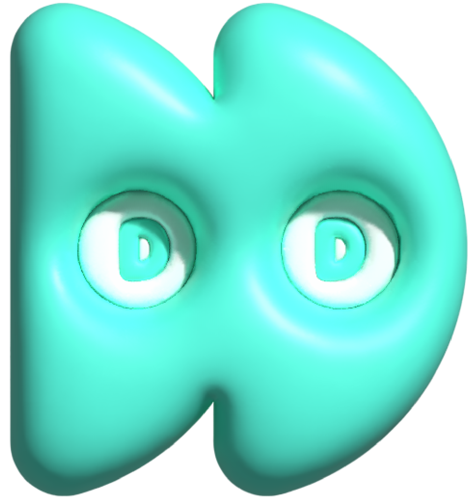

# Dduckddack

<div align="center">
<a href="https://dduckddack.org">

</a>

<br/>
</div>
Dduckddack create your Mobile wallpaper NFT.

This project was developed to enhance user access to NFTs.

To facilitate this, the administrator covers the gas fees, allowing users to simply create a wallet and mint an NFT.

### Notice

[Metamask](https://metamask.io/) require to use this project.

Currently, deployed at **MUMBAI** network.

**_Mobile version is not stable because of using in-app-broswer._**

## Tech Stack

   

## What can you do?

### Mint your Mobile Wallpaper NFT


Desgin pattern and Emoji is supported by web. you can make random wallpaper. ( Each wallpaper is unique)

---

## Install the dependencies

```bash
npm install
```

### Start the app in development mode

```bash
npm run dev
```

## Usage

Before use this project, there are several requierments.

- Smart contract (ERC-721) [dddd_V1](https://github.com/jumyeong33/dddd_contract)
- Images at Aws s3
- Storage to save Metadata && Image (In this project : Infura)
- Crypto Wallet with some balance of Native token

### Minting flow

Create NFT metadata and Image, Minting flow run on Aws lambda.

Reference on lambda_code diretory

Check **Version** before using lambda code

 &nbsp; &nbsp; 

```javascript
//lambda_code/ipfsHandler.js
result = await UploadAsset(imageBuffer);
const metadataRes = await UploadMetadata(tempMetadata, result.Hash);

const sender = requestData.data.sender;
const uniqueKey = Number(tempMetadata.name.split("#")[1]);

const tokenURI = BASE_URL + metadataRes.Hash;

const receipt = await mintingNFT(sender, uniqueKey, tokenURI);
```

First, Wallpaper Image is sent by client as buffer format.

Then Upload Image on IPFS, make metadata form with Image url.

This metadata uri will be set on smart contract as token_uri.
